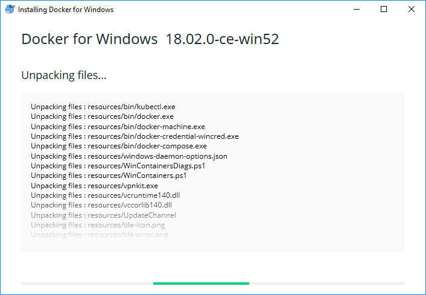
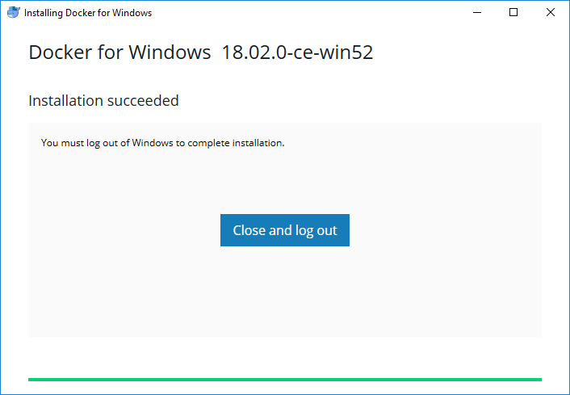
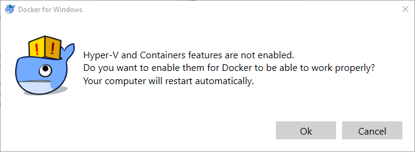
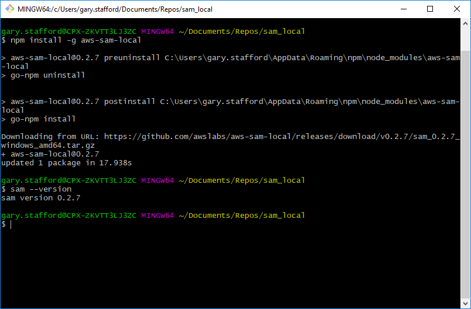
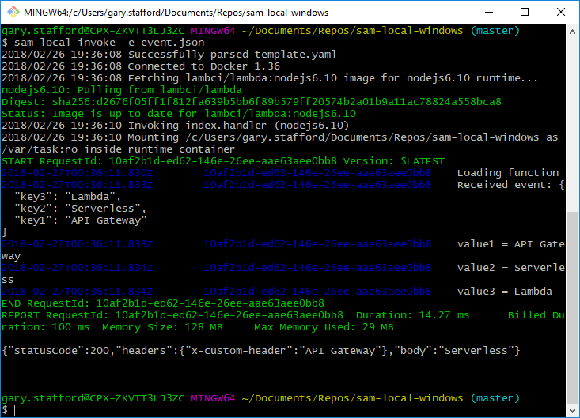
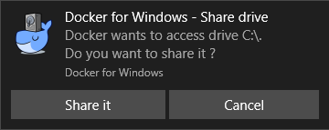

# SAM Local Installation

Install SAM Local on Windows 10 Enterprise. Test SAM Local with a simple Lambda function.

According to [AWS](https://github.com/awslabs/aws-sam-local#sam-local-beta), '_sam is the AWS CLI tool for managing Serverless applications written with AWS Serverless Application Model (SAM). SAM Local can be used to test functions locally, start a local API Gateway from a SAM template, validate a SAM template, and generate sample payloads for various event sources._'

## Install Docker for Windows

SAM Local requires Docker. Link to [Docker for Windows](https://docs.docker.com/docker-for-windows/install/#download-docker-for-windows). Choose the Stable or Edge version of Docker for Windows.



You will need to close and logout.



Windows will ask you to restart to enable Hyper-V and Containers features.



## Install AWS SAM Local

Install `aws-sam-local` npm package globally. Assumes Node.js/npm already installed.

```javascript
npm install -g aws-sam-local
sam --version
```



## Sample Lambda Function

Example is a combination of several public AWS samples.

Lambda: `index.js`

```javascript
'use strict';

console.log('Loading function');

exports.handler = (event, context, callback) => {
  console.log('Received event:', JSON.stringify(event, null, 2));
  console.log('value1 =', event.key1);
  console.log('value2 =', event.key2);
  console.log('value3 =', event.key3);
  callback(null, {
    statusCode: 200,
    headers: {
      "x-custom-header": event.key1
    },
    body: event.key2
  });
};
```

Test Event: `event.json`

```json
{
  "key3": "Lambda",
  "key2": "Serverless",
  "key1": "API Gateway"
}
```

SAM Template: `template.yaml`

```yaml
AWSTemplateFormatVersion: '2010-09-09'
Transform: 'AWS::Serverless-2016-10-31'
Description: A starter AWS Lambda function.
Resources:
  helloworld:
    Type: 'AWS::Serverless::Function'
    Properties:
      Handler: index.handler
      Runtime: nodejs6.10
      CodeUri: .
      Description: A starter AWS Lambda function.
      MemorySize: 128
      Timeout: 3
      Events:
        Api:
          Type: Api
          Properties:
            Path: /test
            Method: get
```

### Invoke Lambda with an Event file

To test SAM Local, execute `npm test` or `sam local invoke -e event.json`.



The first time you run SAM Local, you will need to share access to your C: drive.



## Deploy API to AWS

Execute the two commands below to deploy of the Lambda function and associated API to AWS, using [SAM](https://docs.aws.amazon.com/lambda/latest/dg/serverless_app.html). Commands require you have sufficient privileges to AWS resources.

These commands will create an S3 bucket (you will need to substitute a unique bucket name for the bucket), API, in the API Gateway, titled `test-api`, matching the CloudFormation stack name. The Lambda will also be created, titled similar to `test-stack-helloworld-1SOIAN9J9EUJS`. The Lambda function will be associated with the `GET` method of the `/test` API endpoint.

```bash
aws s3 mb s3://<unique_bucket_name>

aws cloudformation package \
  --template-file template.yaml \
  --s3-bucket <unique_bucket_name> \
  --output-template-file packaged-template.yaml

aws cloudformation deploy \
  --template-file packaged-template.yaml \
  --stack-name test-api \
  --capabilities CAPABILITY_IAM
```

## SAM Local References

- [SAM Local Requirements](https://docs.aws.amazon.com/lambda/latest/dg/sam-cli-requirements.html)
- [SAM Local Guide](https://github.com/awslabs/aws-sam-local)
- [SAM Node Hello World Sample](https://github.com/awslabs/serverless-application-model/tree/master/examples/apps/hello-world)
